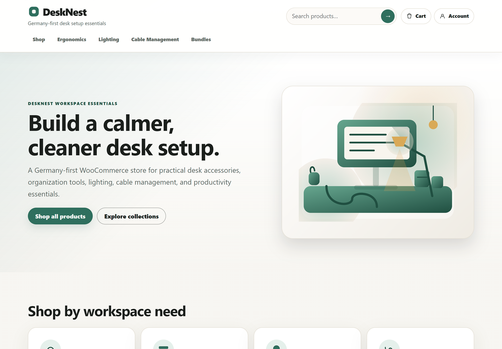
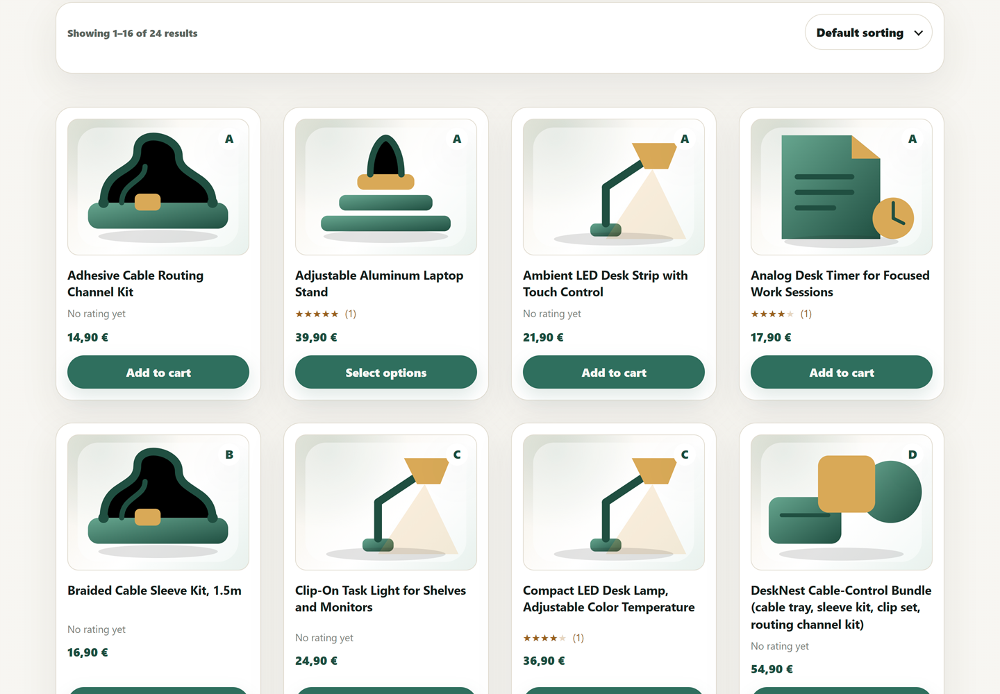
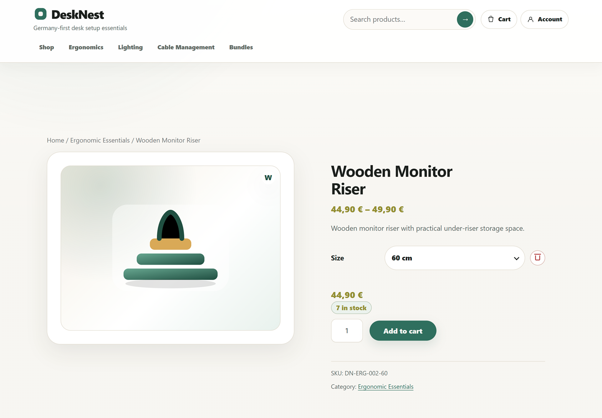
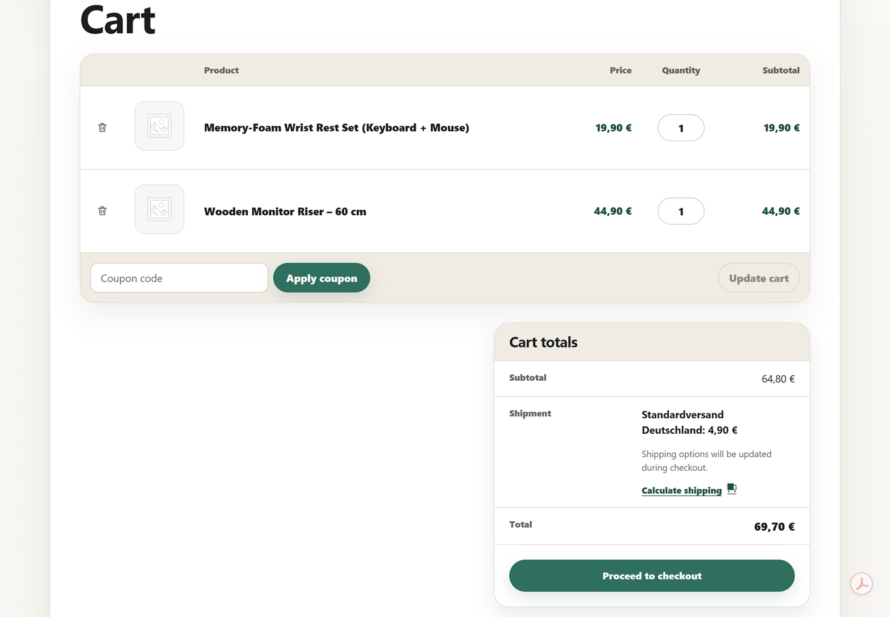
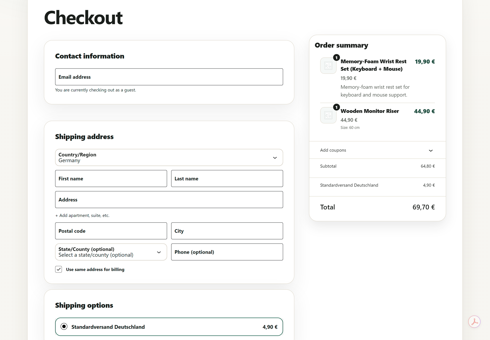
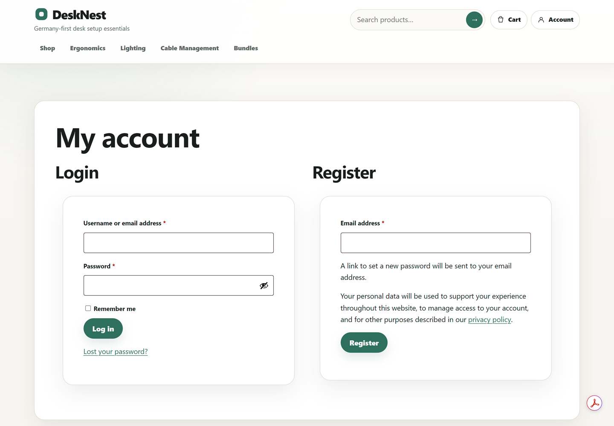
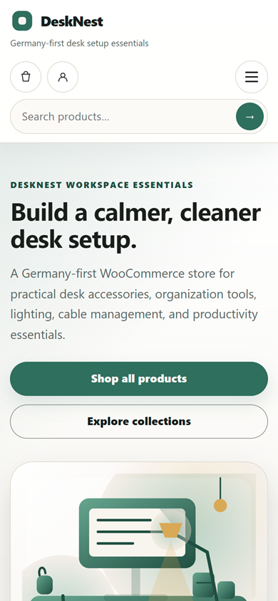
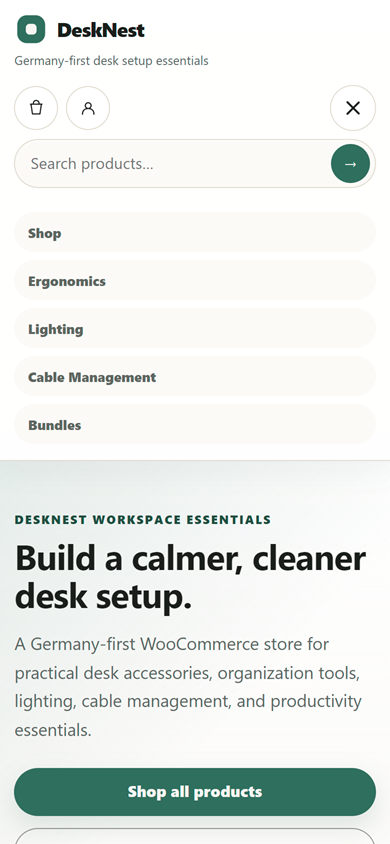

# WooCommerce Store – WordPress

DeskNest is a local WordPress/WooCommerce portfolio project for a realistic Germany-first desk-setup, ergonomic workspace, home-office, and productivity-accessories store.

The project demonstrates practical WordPress, WooCommerce, PHP theme development, frontend implementation, Git workflow, e-commerce configuration, documentation, and QA skills. It is built as a local development project, not as a production deployment or live commercial shop.

## Project Status

| Area | Current state |
| --- | --- |
| Business concept | DeskNest, a curated Germany-first workspace-accessories store |
| WooCommerce foundation | Installed, configured, and validated locally |
| Product catalog | 6 commercial categories, 24 published products |
| Product types | 19 simple products, 5 variable products, 11 variations |
| Active final theme | Custom classic PHP theme: `desknest-storefront` |
| Quality review | Scope 22 QA completed; 4 storefront defects fixed and retested |
| Production deployment | Not deployed; no public live demo exists |
| Portfolio media | Scope 24 includes 13 curated and validated storefront screenshots plus a portfolio presentation |

## Storefront Preview

DeskNest now includes a curated storefront screenshot set for quick portfolio review. The full recruiter-facing case study and complete screenshot gallery are available in [Portfolio Presentation](docs/portfolio-presentation.md).



| Shop archive | Selected variable product |
| --- | --- |
|  |  |

| Cart workflow | Checkout workflow |
| --- | --- |
|  |  |

| Customer account access | Review the full gallery |
| --- | --- |
|  | The full case study includes all 13 curated desktop and mobile storefront views, implementation highlights, QA evidence, and honest project boundaries. |

| Mobile homepage | Open mobile navigation |
| --- | --- |
|  |  |

## Store Concept

DeskNest is designed as a focused store for customers who want a cleaner, more comfortable, and more productive desk setup without luxury-office pricing.

Target customers include:

- Remote and hybrid professionals.
- Freelancers and independent creators.
- Students and home-office users.
- Developers and multi-device workspace users.
- Germany-first buyers, with EU-friendly future positioning.

## WooCommerce Feature Summary

| Feature area | Implemented local project state |
| --- | --- |
| Categories and products | 6 DeskNest categories, 24 published products |
| Attributes and variations | 3 global attributes, 5 variable products, 11 variations |
| Inventory | SKU strategy, stock quantities, low-stock and out-of-stock scenarios |
| Cart | Classic Cart implementation styled and validated with the final theme |
| Checkout | WooCommerce Checkout Block integrated and styled locally |
| Customer accounts | Registration, login, dashboard, orders, downloads, addresses, and account-details states styled and validated locally |
| Orders | Local order-management workflow validated against one development order |
| Coupons | 4 realistic local coupons configured and validated |
| Reviews | 7 local-safe product reviews seeded and styled |
| Payments | One local-development-only BACS payment method; no real bank details |
| Shipping | One Germany-only zone with flat rate and free-shipping threshold |
| Reports and analytics | Native WooCommerce Reports/Analytics reviewed against local data |

## Technical Stack

- WordPress 7.0 in LocalWP.
- WooCommerce 10.9.3.
- PHP 8.2.29.
- MySQL 8.4.0.
- HTML, CSS, JavaScript, and WordPress PHP templates.
- Git and GitHub for version control.
- LocalWP for local development.

## Theme and Architecture

### Active Final Theme

The final active portfolio theme is:

```text
app/public/wp-content/themes/desknest-storefront/
```

It is a custom classic PHP WordPress theme with WooCommerce support. It includes:

- PHP templates and reusable template parts.
- `theme.json` design tokens.
- Selected WooCommerce template overrides.
- One custom vanilla JavaScript file.
- Responsive custom CSS for the storefront, product pages, Classic Cart, Checkout Block, My Account, header, search, navigation, and footer.

### Rollback Theme

The earlier rollback theme is:

```text
app/public/wp-content/themes/desknest/
```

It was the original custom block-theme implementation from earlier scopes and is preserved as rollback safety. It is not the final active portfolio theme.

## Repository Structure

| Path | Purpose |
| --- | --- |
| `README.md` | GitHub-facing project overview |
| `docs/` | Scope records, architecture notes, QA evidence, and documentation index |
| `docs/portfolio-presentation.md` | Recruiter-facing DeskNest case study and complete screenshot gallery |
| `docs/screenshots/` | Curated validated desktop and mobile storefront screenshots |
| `app/public/wp-content/themes/desknest-storefront/` | Final tracked custom WooCommerce storefront theme |
| `app/public/wp-content/themes/desknest/` | Earlier tracked rollback block theme |
| `.gitignore` | Keeps WordPress core, runtime files, uploads, secrets, plugins, and generated files out of Git |

WordPress core, WooCommerce plugin files, `wp-config.php`, uploads, database dumps, LocalWP runtime files, local users, local orders, and local products/settings as portable seed data are intentionally not tracked.

## Local Setup Notes

This repository is not a complete portable WordPress installation and does not include a database snapshot.

To work with the project locally:

1. Use a local WordPress environment such as LocalWP.
2. Install WordPress and WooCommerce separately.
3. Use or copy the tracked `desknest-storefront` theme directory into `wp-content/themes/`.
4. Recreate WooCommerce catalog/configuration from the documentation if needed.
5. Do not commit real secrets, `wp-config.php`, uploads, database dumps, or local runtime files.

The exact validated LocalWP database state cannot be recreated from `git clone` alone. A future export or bootstrap workflow would be required for automatic reconstruction.

## Documentation Navigation

Start with the full documentation index:

- [Project Documentation Index](docs/README.md)

Best current-state references:

- [Portfolio Presentation](docs/portfolio-presentation.md) - recruiter-facing case study and complete screenshot gallery.
- [UI Polish](docs/ui-polish.md) – final active `desknest-storefront` theme architecture and UI implementation.
- [Testing & Quality Review](docs/testing-quality-review.md) – Scope 22 QA evidence, limitations, and defect retesting.
- [Product Catalog](docs/product-catalog.md) – implemented product categories and products.
- [Product Attributes & Variations](docs/product-attributes-variations.md) – global attributes and variable products.
- [Inventory & Stock Management](docs/inventory-stock-management.md) – SKU, stock, low-stock, and out-of-stock strategy.

Historical scope documents are still valuable evidence, but later scope documents may supersede earlier implementation-state statements.

## Testing and Quality

Scope 22 documents structured QA across static checks, route checks, responsive browser checks, keyboard/accessibility-focused checks, and targeted regression retests. Four confirmed storefront defects were fixed and retested in the local environment.

This is not a full WCAG audit, screen-reader certification, complete browser/device matrix, production QA sign-off, or real payment/order test.

## Security and Performance Boundaries

Security work is local-development-safe only: no production WAF, CDN, rate limiting, malware scanning, penetration testing, real SSL deployment, or complete security audit is claimed.

Performance work documents a LocalWP baseline and asset-loading review. It does not claim production Lighthouse scores, Core Web Vitals, production caching, CDN behavior, or deployed performance.

## Portfolio Presentation

Scope 24 organizes 13 curated storefront screenshots under `docs/screenshots/desktop/` and `docs/screenshots/mobile/`. The full [Portfolio Presentation](docs/portfolio-presentation.md) contains implementation highlights, workflow evidence, responsive views, testing evidence, and project boundaries.

GitHub Pages and LinkedIn/Open Graph preview assets remain deferred to later scopes.

## Known Limitations

- No production deployment or public live demo exists.
- No real payment credentials, real bank details, carrier integration, shipment fulfilment, or real customer data exists.
- The validated database state is local and not portable from Git alone.
- Real product photography and WooCommerce product featured images are not included in the current repository.
- No CI/CD, Docker, GitHub Actions, or containerized workflow is implemented.
- No full WCAG compliance, screen-reader certification, penetration testing, or full security audit is claimed.
- No production Lighthouse/Core Web Vitals results are claimed.
