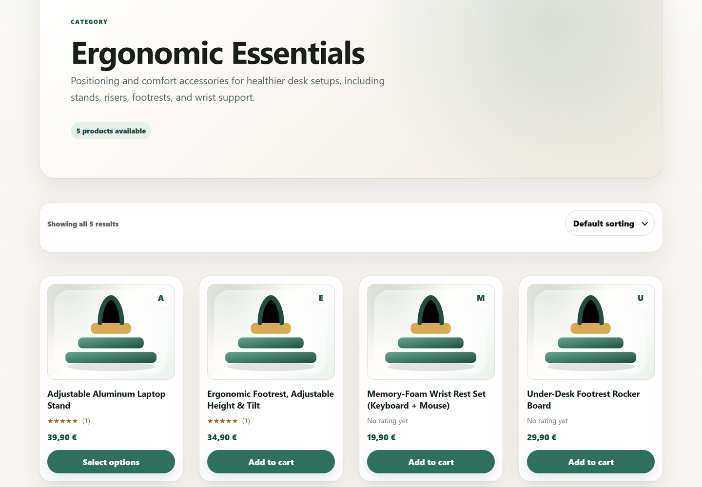
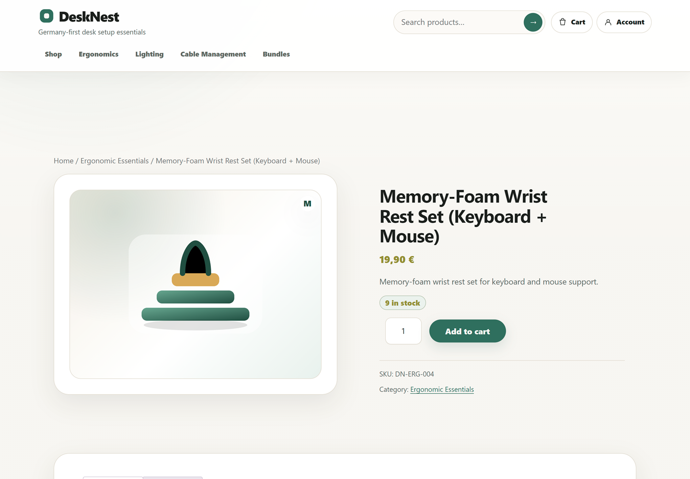
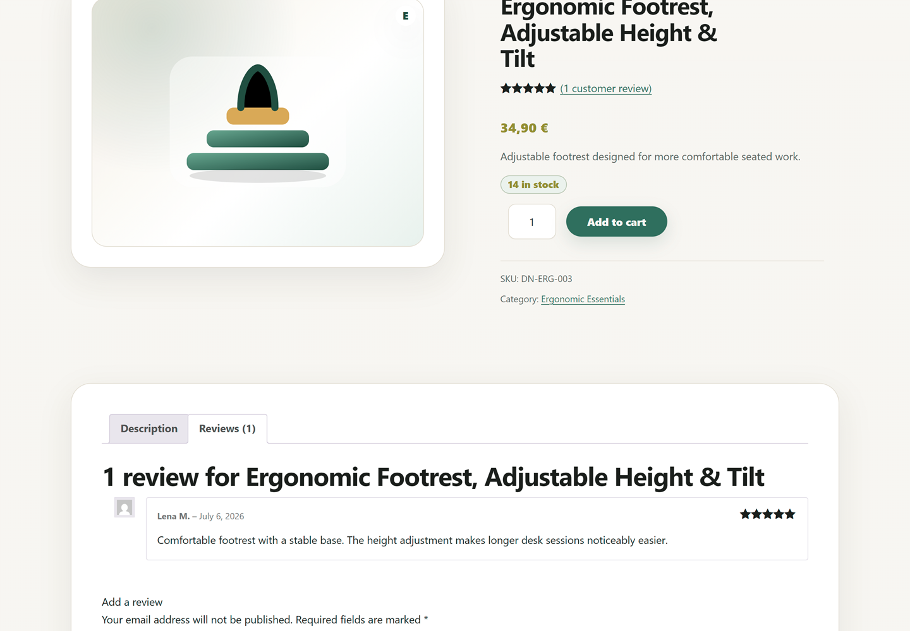
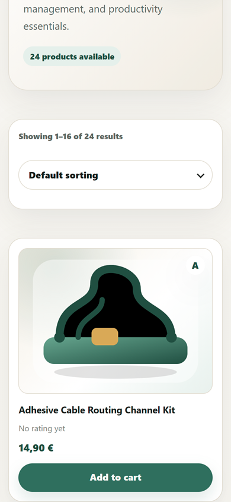
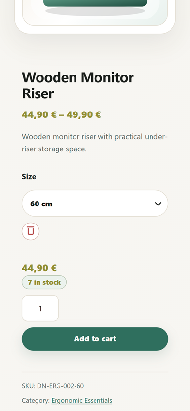

# DeskNest Portfolio Presentation

## Project Snapshot

| Area | Current project state |
| --- | --- |
| Project type | Local WordPress/WooCommerce portfolio store |
| Commercial concept | DeskNest, a Germany-first desk-setup and workspace-accessories store |
| Target market | Remote professionals, hybrid workers, freelancers, students, developers, and home-office users |
| Platform | WordPress 7.0, WooCommerce 10.9.3, PHP 8.2.29, MySQL 8.4.0 in LocalWP |
| Active theme architecture | Custom classic PHP theme: `desknest-storefront` |
| Catalog size | 6 commercial categories and 24 published products |
| Product types | 19 simple products, 5 variable product parents, and 11 variations |
| Responsive coverage | Desktop screenshots at 1440 x 1000 and mobile screenshots at 390 x 844 |
| Current deployment boundary | Local development project with no public live demo |

## Commercial Concept

DeskNest is a focused desk-setup and workspace-accessories store for Germany-first buyers. The catalog centers on ergonomic essentials, desk organization, lighting and ambience, cable management, productivity accessories, and practical bundles.

The target customers are people building better workspaces at home or in hybrid settings: remote professionals, freelancers, students, developers, and general home-office users. The concept is intentionally narrow. It is not a generic tutorial shop; the product mix, pricing, categories, copy, shipping assumptions, and storefront presentation are designed around one credible commercial niche.

## Project Objectives

The project was built to demonstrate practical implementation skills rather than a surface-level demo. The main objectives were:

- WordPress and WooCommerce architecture for a realistic local store.
- Custom PHP theme development without relying on a page builder.
- Realistic commerce configuration for products, categories, attributes, inventory, shipping, coupons, reviews, accounts, cart, and checkout.
- Responsive UI and UX across representative storefront states.
- Scope-based QA, debugging, and documentation.

## Technical Architecture

The current storefront uses WordPress and WooCommerce with a custom classic PHP theme named `desknest-storefront`. The theme includes `theme.json` design settings, selected WooCommerce template overrides, reusable template parts, responsive CSS, and one vanilla JavaScript asset.

The theme handles a mixed WooCommerce surface:

- Classic PHP templates for storefront pages and selected WooCommerce overrides.
- Classic Cart handling through a WooCommerce cart template override.
- Checkout Block styling through scoped block-compatible CSS.
- Reusable product-card and shop-archive template parts.
- A preserved rollback theme at `app/public/wp-content/themes/desknest/`.

The UI layer avoids a page-builder architecture and keeps plugin dependencies limited to WooCommerce for the store functionality.

## WooCommerce Implementation

The local WooCommerce implementation includes:

- 6 commercial product categories.
- 24 published products.
- 19 simple products.
- 5 variable product parents.
- 11 variations.
- 3 global attributes.
- SKU and inventory strategy with stock quantities, low-stock, and out-of-stock scenarios.
- Styled cart and checkout flows.
- Customer account pages and logged-out account access.
- A local order-management workflow validated against development data.
- 4 realistic local coupons.
- 7 local-safe product reviews.
- Local-development-only BACS payment configuration.
- Germany shipping zone and methods.
- Native WooCommerce Reports and Analytics review against local data.

## Storefront Experience

### Homepage and Catalog

The homepage introduces the DeskNest concept, primary store navigation, calls to action, and the beginning of the workspace-category browsing experience.

The shop archive demonstrates the catalog browsing layout, sorting controls, product cards, prices, ratings, and add-to-cart entry points.

The category archive shows focused browsing for the Ergonomic Essentials category.

### Product Experience

The simple product view demonstrates product hierarchy, price, stock state, SKU, category context, and add-to-cart presentation.

The variable product view shows a selected variation, updated SKU, stock messaging, selected price, and enabled add-to-cart state.

The product review screenshot demonstrates rating display, local-safe review content, and review-form styling.

### Commerce and Customer Flow

The cart view demonstrates the Classic Cart implementation, two-product summary, coupon area, Germany shipping, and total calculation presentation.

The checkout view shows the Checkout Block presentation with blank privacy-safe fields and a two-product order summary. No order was submitted for this screenshot.

The logged-out account state demonstrates customer entry points without exposing saved credentials, account identity, or private data.

## Responsive Experience

The mobile homepage demonstrates the compact header, CTA hierarchy, and single-column content rhythm.

The open navigation screenshot shows the mobile menu state and responsive navigation organization.

The mobile shop screenshot demonstrates the responsive single-column catalog card pattern, product count, sorting control, product image, rating state, price, and add-to-cart button.

The mobile variable-product screenshot shows a selected 60 cm variation, updated price, stock state, variation SKU, and enabled add-to-cart button without adding the product to the cart.

## UI and UX Decisions

DeskNest uses a calm, practical visual language for a productivity-focused workspace store. The theme emphasizes readable typography, consistent spacing, reusable card surfaces, clear product hierarchy, and responsive layouts that avoid fragile fixed-width assumptions.

The storefront includes responsive navigation, product-card surfaces, WooCommerce notices, empty states, validation states, cart and checkout controls, account forms, and accessible focus-state intent. The implementation also pays attention to consistency between classic WooCommerce templates and the block-based checkout surface.

This project does not claim formal accessibility certification.

## Quality Assurance

Scope 22 documented a structured QA pass for the local storefront. The review included:

- Static PHP and JavaScript checks.
- Route and workflow checks for representative storefront states.
- Responsive checks at 390, 480, 768, 900, and 1440 pixel widths.
- Keyboard and accessibility-focused checks for selected interactive states.
- Four confirmed storefront defects fixed and retested.

The QA evidence is local and scope-based. It is not a full device/browser certification, real payment test, complete accessibility audit, or production security review.

## Git and Documentation Workflow

The project follows a stable `main` branch approach with focused feature branches where appropriate. Work is documented scope by scope, with validation before merge and professional commits for meaningful milestones.

The documentation index links the current implementation state, historical scope records, QA evidence, and this portfolio presentation. Earlier documents remain useful as timeline evidence, but later documents may supersede older implementation-state statements.

The project does not include CI/CD or GitHub Actions.

## Honest Project Boundaries

DeskNest is a local development project. It has no public live demo, no production deployment, no real payment credentials or bank details, no carrier fulfilment integration, no portable database snapshot, no real customer data, no production security audit, no production Lighthouse/Core Web Vitals result, no Docker workflow, no CI/CD pipeline, and no GitHub Actions setup.

The current product visuals are illustrated assets and generated/storefront visuals, not real product photography. WooCommerce product featured images are not included in the current repository.

## Recruiter Takeaway

DeskNest demonstrates practical WooCommerce architecture, WordPress/PHP theme development, e-commerce configuration, responsive frontend implementation, QA/debugging discipline, Git workflow, and technical documentation. The project is intentionally honest about its local-development boundary while still presenting a realistic commercial storefront concept and a polished implementation record.
